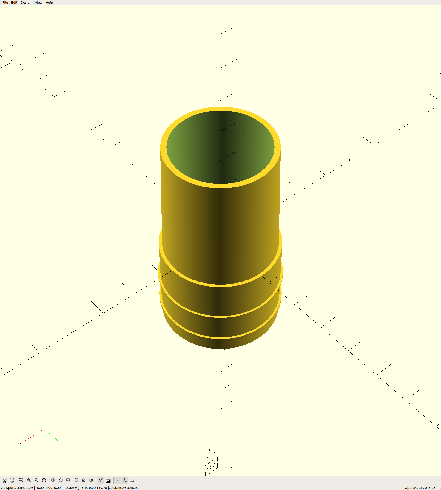

# dustcollectorcouplers

These couplers are an easy way to hook up cheap "dust collection" to a Maslow
CNC machine.  The length of the hose lets you move the exhaust vent to the edge
of your workshop.

This is used to connect a [Home Depot
BucketHead](https://www.homedepot.com/p/Bucket-Head-5-gal-1-75-Peak-HP-Wet-Dry-Vac-BH0100/202017218)
to a [Ridgid
R22002](https://www.homedepot.com/p/RIDGID-11-Amp-2-HP-1-2-in-Corded-Fixed-Base-Router-R22002/202739521)
using an [Everbilt 1 1/4" hose
kit](https://www.homedepot.com/p/Everbilt-1-1-4-in-x-24-ft-Sump-Pump-Discharge-Hose-Kit-EBHK24/205618043).
